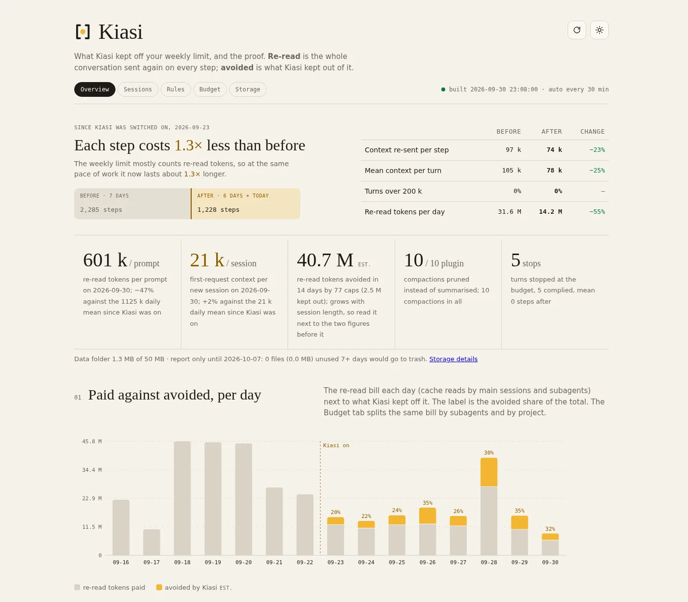

<picture>
  <source media="(prefers-color-scheme: dark)" srcset="docs/logo-dark.svg">
  
</picture>

**Make your Claude Code limit last.**

Kiasi is a Claude Code plugin that makes your weekly limit last longer. Every step of Claude Code re-sends the whole conversation, so one noisy tool output is paid for again on every step after it. Kiasi keeps that noise out with fixed rules, on your machine, with no model calls and no network.

On the machine it was built on, context re-sent per step went from 201k to 31k tokens, 6.5× less, and steps over 200k context went from 52% to 0%. Your own before-and-after is on the local dashboard the day after you install.

[**Website**](https://raj-rangani.github.io/kiasi/) · [Changelog](CHANGELOG.md) · MIT

## Key features

- **Output cap and cleaning**: tool output over 12,000 chars is cut, progress bars and repeated lines are stripped, the full text is saved to disk and named in the cut.
- **Turn budget and loop check**: warned at 30 tool calls, stopped at 60; the same call failing 3 times tells Claude to rethink instead of retry.
- **Re-read skip**: a file already in context and unchanged comes back as a pointer, not the text again.
- **Paste manager**: a paste over 4,000 chars is saved to disk; over 40,000 it is refused and you resend with the path.
- **Pruner and state** (experimental): at compaction your prompts and Claude's replies stay word for word while old tool output is pruned; the task, edited files and failing commands are re-injected.
- **Local dashboard**: every action Kiasi took, the tokens it kept off your limit, your 5-hour and weekly limits, rebuilt every 30 minutes at `http://127.0.0.1:8787/`.

## Quick start

In Claude Code:

```
/plugin marketplace add raj-rangani/kiasi
/plugin install kiasi@kiasi
```

Add two settings to the `env` block of `~/.claude/settings.json`. Kiasi reminds you at session start if either is missing.

```json
"CLAUDE_CODE_AUTO_COMPACT_WINDOW": "200000",
"CLAUDE_CODE_ENABLE_FUNCTION_HOOKS": "1"
```

The first compacts at 200k instead of the full window and is the biggest single lever. The second turns on the experimental pruner and search.

Restart Claude Code and work as usual. Run `/kiasi:limits setup` once so the dashboard can show your plan limits. The dashboard starts itself with every session.

## How it works

Each rule is a Claude Code hook with a fixed threshold you can change. Nothing is decided by a model.

| Leak | Rule | Hook |
|---|---|---|
| One install log rides along on every step after it | Output cap and cleaning | `PostToolUse` |
| A 60-step turn chasing one failing test | Turn budget and loop check | `PostToolUse`, `PostToolUseFailure` |
| The same file, read again, unchanged | Re-read skip | `PreToolUse` |
| A whole log pasted to ask one question | Paste manager | `UserPromptSubmit` |
| Compaction forgets what you were doing | Pruner and state | `session.compact` (experimental) |
| No idea where the week went | Local dashboard | `SessionStart` |

Cuts keep the head and tail and leave a `[kiasi kept …]` or `[kiasi trimmed …]` marker naming the saved file. File reads, range commands and diffs are never cut, so code quality does not depend on the cap.

## Dashboard



The days before you installed Kiasi are the baseline, built from your own transcripts. Every cut, skip and stop is a row with the file it saved and what it kept out. A per-day history outlives Claude Code's transcript retention, so the comparison does not expire.

| Command | What it does |
|---|---|
| `/kiasi:dashboard` | Start the dashboard if it is not up and print its URL |
| `/kiasi:sync` | Rebuild the reports now |
| `/kiasi:limits setup` | Install the Kiasi status line, the only source of your plan limits |
| `/kiasi:limits remove` | Put your previous status line back |

## Privacy

- No network calls. Kiasi reads your local transcripts and writes to its own folder under `~/.claude/plugins/data/`.
- No prompt text is logged. Reports hold counts and sizes, never what you typed.
- The dashboard listens on `127.0.0.1` only and refuses other host names.
- Nothing is lost. Every cut output and refused paste is saved in full and found again with `mcp__kiasi__search` or `scripts/search.py`.
- Saved files are moved to `trash/` after 7 unused days (pastes 14) and deleted 7 days later. The first week is report-only, `cleanup.py --restore` undoes a move, and `KIASI_CLEANUP=off` disables it.

## Settings

Set these with `/config` or as env vars. Every other threshold is a named constant in `scripts/core/constants.py` or `hooks/constants.js`.

| Setting | Env var | Default |
|---|---|---|
| `output_cap_chars` | `CLAUDE_PLUGIN_OPTION_OUTPUT_CAP_CHARS` | 12000 |
| `turn_call_budget` | `CLAUDE_PLUGIN_OPTION_TURN_CALL_BUDGET` | 60 |
| `paste_refusal_chars` | `CLAUDE_PLUGIN_OPTION_PASTE_REFUSAL_CHARS` | 40000 |
| `compaction_window_text` | `CLAUDE_PLUGIN_OPTION_COMPACTION_WINDOW_TEXT` | "200000" |

`KIASI_DASHBOARD=off` stops the session-start autostart of the dashboard.

## Requirements

- Claude Code 2.1.283+
- Python 3.8+, standard library only
- Linux (tested) or macOS (expected to work). Windows is not supported.
- Node 18+ only for the experimental function hooks

## Development

```
python3 -m unittest discover -s tests   # hook handlers, reports, dashboard
claude plugin test .                     # hooks/*.test.ts on the real engine
claude plugin validate .                 # manifest, marketplace and hooks.json
```

`scripts/kiasi.py` is the hook entry point and dispatches to `scripts/core/`. Reports live in `scripts/reports/`, the dashboard in `dashboard/`, and `scripts/README.md` says which hook calls what.

## Uninstall

Run `/kiasi:limits remove` if you set up the status line, then `/plugin uninstall kiasi`. Your data folder stays until you delete it.

## License

MIT. Not affiliated with Anthropic.
