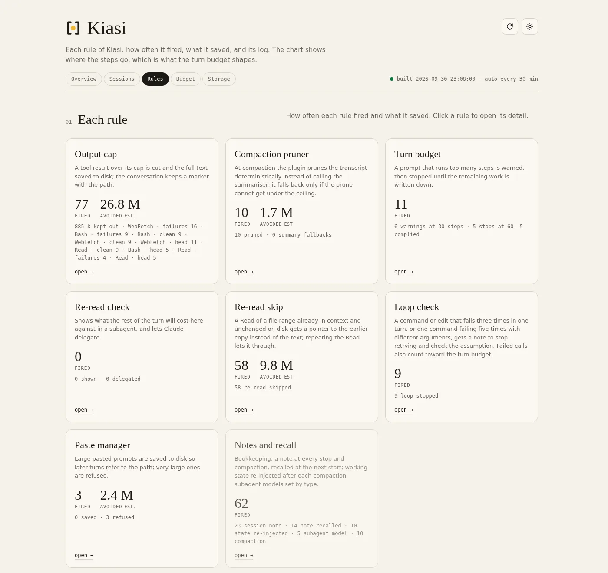
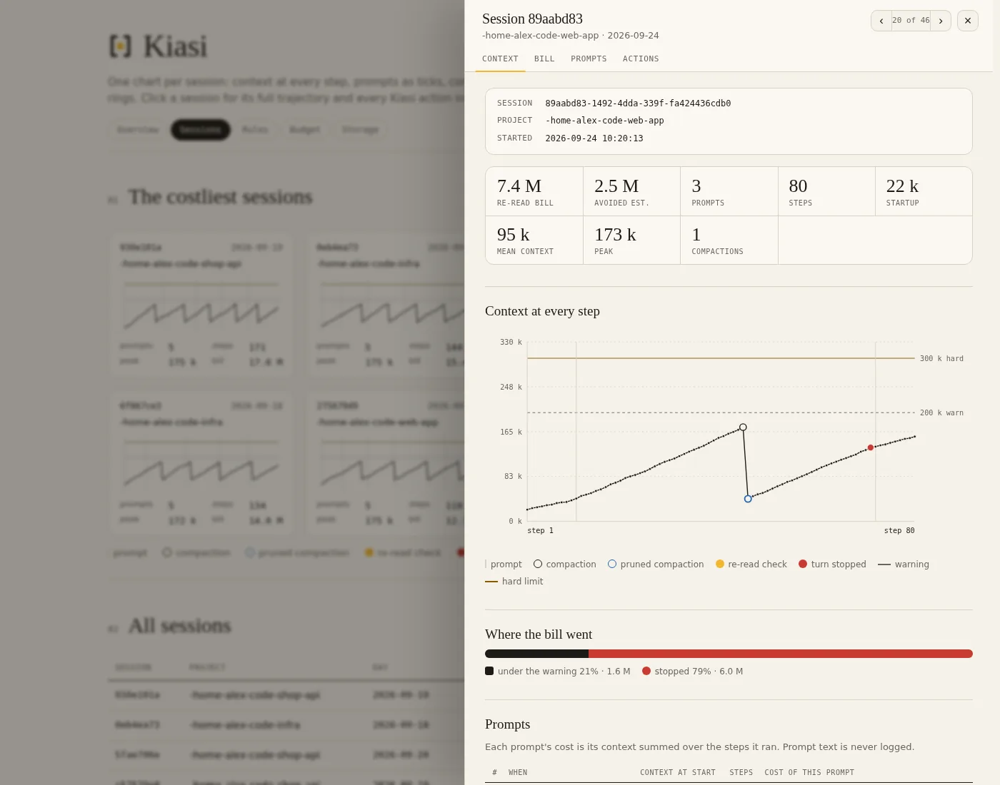

# Kiasi

**Make your Claude Code weekly limit last longer.**

[](https://github.com/raj-rangani/kiasi/actions/workflows/ci.yml)


Every step in Claude Code re-sends the whole conversation, so what you really
pay for is **context size × number of steps**. Kiasi is a Claude Code plugin
that keeps both small: it caps huge tool outputs, stops runaway turns, refuses
mega-pastes, prunes the transcript at compaction, and shows you exactly what it
saved on a local dashboard.

It uses fixed rules, not model calls, has no dependencies beyond Python's
standard library, and **sends nothing anywhere**.


*Screenshots use fictional sample data.*

> **Beta.** Kiasi is new and has mostly been used by one person. Expect rough
> edges, and please [open an issue](https://github.com/raj-rangani/kiasi/issues)
> when something blocks you or a number looks wrong.

*kiasi (Swahili): measure, moderation. Kwa kiasi, in moderation.*

## Quick start

1. Install the plugin in Claude Code:
   ```
   /plugin marketplace add raj-rangani/kiasi
   /plugin install kiasi@kiasi
   ```
2. Add two settings to the `env` block of `~/.claude/settings.json`
   ([why](#two-env-settings-worth-setting)):
   ```json
   {
     "env": {
       "CLAUDE_CODE_AUTO_COMPACT_WINDOW": "200000",
       "CLAUDE_CODE_ENABLE_FUNCTION_HOOKS": "1"
     }
   }
   ```
3. Restart Claude Code, then run `/kiasi:limits setup` so the dashboard can
   show your 5-hour and weekly plan limits.
4. Work as usual. After a session or two, run `/kiasi:dashboard` and open the
   URL it prints.

## What it does

| Rule | What happens |
|---|---|
| **Output cap** | Web results, log, transcript and `/tmp` reads, and bulk command output over 12,000 chars are cut. The full text is saved to disk and a `[kiasi kept …]` marker tells Claude where. |
| **Output cleaning** | Build, install, test and search output loses colour codes, progress-bar redraws and runs of repeated lines before any cap. File-reading commands (`cat`, `sed`, `git diff`, …) are never touched. |
| **Turn budget** | A turn is warned at 30 tool calls (or 4M re-read tokens) and stopped at 60 (or 8M). Claude writes the remaining work as a checklist and ends the turn or hands it to one subagent. |
| **Loop check** | When the same call fails 3 times in a turn, or one command fails 5 times with different arguments, Claude is told to stop retrying and check its assumption. |
| **Re-read skip** | Reading a file range that is already in context and unchanged on disk returns a pointer to the earlier copy instead of the text. |
| **Paste manager** | Prompts over 4,000 chars are saved to disk so later turns can refer to the path. Prompts over 40,000 chars are refused: saved, dropped from the conversation, and you're asked to resend the instruction with the path. |
| **Compaction pruner** *(experimental)* | At compaction, replaces the model-written summary with a rule-based prune: your prompts and Claude's replies stay word for word, old tool output is cut to its head, errors are kept longer. Falls back to the built-in summary if the prune can't reach the target size. |
| **State after compaction** | After a compaction, Kiasi re-injects the task, edited files, commands still failing, saved outputs and checklists, read from the transcript. |
| **Notes and recall** | A note is written at every stop and compaction and injected at the next session start for that project. |
| **Subagent policy** | Sets a default model per subagent type and adds a step budget to every subagent brief. |
| **Context rules** | The working rules (one task per session, no polling, read files by section, …) are injected at session start from `rules.md`. Nothing to paste into your `CLAUDE.md`. |
| **Search** *(experimental)* | `mcp__kiasi__search` does full-text search over everything Kiasi saved: outputs, pastes, notes and checkpoints. |

## Dashboard

`/kiasi:dashboard` starts a small local server (127.0.0.1 only) and prints its
URL. It has five tabs: **Overview** (before and after, paid against avoided),
**Sessions**, **Rules**, **Budget** (where the weekly limit goes) and
**Storage** (what Kiasi keeps on disk). Reports rebuild every 30 minutes, or
immediately with the Sync button or `/kiasi:sync`.



Click any session for its full trajectory: context at every step, compactions
(a blue ring when Kiasi pruned it), turn stops, where the bill went, and every
Kiasi action inside it.



Figures marked "est." are computed from a formula; hover them to see it.

### Commands

| Command | What it does |
|---|---|
| `/kiasi:dashboard` | Start the dashboard and print its URL |
| `/kiasi:sync` | Rebuild the reports now |
| `/kiasi:limits setup` | Install the Kiasi status line, the only source of your plan limits |
| `/kiasi:limits remove` | Put your previous status line back |
| `/kiasi:limits` | Show whether the status line is set up and when limits were last saved |

### Plan limits

The 5-hour and weekly limits in the dashboard header come from the Claude Code
status line, the only place Claude Code exposes them. `/kiasi:limits setup`
copies `scripts/statusline.py` to `~/.claude/kiasi/` and points `statusLine`
in `~/.claude/settings.json` at it, backing the file up once to
`settings.json.kiasi-bak`. A status line you already had keeps running, with
the Kiasi part appended. Run `setup` again after a plugin update to refresh the
copy.

### Keeping the dashboard up

To keep the dashboard running permanently on Linux, a systemd user unit works:
`ExecStart=/usr/bin/python3 <plugin root>/scripts/dashboard.py 8787`,
`Restart=always`, enabled with `systemctl --user enable --now`. Then bookmark
http://127.0.0.1:8787/.

## Privacy: what it reads, and what it doesn't send

Kiasi reads every transcript file under `~/.claude/projects` (your own
conversation history, main sessions and subagents) to compute context size,
steps per prompt and the reports. It writes only to its data directory, makes
no network calls of any kind, and never logs prompt text. The dashboard
listens on 127.0.0.1 only, refuses requests addressed to any other host name,
and rebuilds reports only when asked from its own pages.

## Two env settings worth setting

A plugin cannot set your environment, so these go in the `env` block of
`~/.claude/settings.json` by hand (see [Quick start](#quick-start)). Kiasi
works without them, just less effectively; if either is missing, session start
adds one warning line with the exact snippet.

- `CLAUDE_CODE_AUTO_COMPACT_WINDOW=200000` caps the context window so
  compaction happens well before the re-read bill grows large. This is the
  single biggest lever: on the machine Kiasi was built on, it took mean context
  from roughly 250k to 57k tokens.
- `CLAUDE_CODE_ENABLE_FUNCTION_HOOKS=1` turns on the experimental compaction
  pruner and the search tool. Everything else works without it.

## Configuration

Four values are `userConfig` in `.claude-plugin/plugin.json` (set them with
`/config`) and can also be set as env vars:

| userConfig key | env var | default |
|---|---|---|
| `output_cap_chars` | `CLAUDE_PLUGIN_OPTION_OUTPUT_CAP_CHARS` | 12000 |
| `turn_call_budget` | `CLAUDE_PLUGIN_OPTION_TURN_CALL_BUDGET` | 60 |
| `paste_refusal_chars` | `CLAUDE_PLUGIN_OPTION_PASTE_REFUSAL_CHARS` | 40000 |
| `compaction_window_text` | `CLAUDE_PLUGIN_OPTION_COMPACTION_WINDOW_TEXT` | "200000" |

Every other threshold is a named constant in `scripts/constants.py` or
`hooks/constants.js`.

## Data directory

All state (event log, saved pastes, outputs, notes and checkpoints, session
records, gzipped report JSON, sync status) is written to
`${CLAUDE_PLUGIN_DATA}`, a path Claude Code exports to every hook process
(normally under `~/.claude/plugins/data/`). Scripts run by hand (the
dashboard, `sync.py`, `search.py`) follow the pointer the session-start hook
leaves in `~/.claude/kiasi/`, so they read the same directory. Nothing is ever
written under the installed plugin code.

### Cleanup

A saved output, checkpoint, paste or session record only matters to the
session that made it, so `scripts/cleanup.py` moves such a file, gzipped, to
`trash/` once the file and its session have both been unused for 7 days
(pastes: 14). Trash is deleted 7 days later. It runs in the background at
session start and on sync, at most once a day, and it:

- touches only file names Kiasi itself writes, never through a symlink;
- never touches the running session or anything used in the last 24 hours;
- removes a notes file only when its newest entry is over 30 days old, and
  never rewrites the event log;
- only reports, moving nothing, for the first 7 days (the Storage tab shows
  what it would move);
- empties trash oldest first above 50 MB, then only warns;
- logs every move, delete and restore to `cleanup.jsonl`.

`python3 scripts/cleanup.py --dry-run` lists what would move, and `--restore`
puts trashed files back. Set `KIASI_CLEANUP` to `report`, `trash` or `off` to
override the default `auto`.

## Experimental: function hooks

The compaction pruner and `mcp__kiasi__search` (`hooks/kiasi.js` and the files
next to it) use Claude Code's function-hook API, which is early access
(2.1.282+) and may break on an engine update. After upgrading Claude Code,
check the debug log for "hooks module ... loaded". Kiasi is fully useful
without it: the seven classic hooks run regardless of
`CLAUDE_CODE_ENABLE_FUNCTION_HOOKS`.

## Requirements

- Claude Code 2.1.283+
- Python 3.8+, standard library only (tested on 3.10 and 3.11)
- Linux (tested) or macOS (expected to work, not yet tested). Windows is not
  supported: cleanup uses `fcntl`.
- Node 18+ only for the experimental function hooks

## Development

```
python3 -m unittest discover -s tests   # hook handlers, reports, dashboard (runs in CI)
claude plugin test .                     # hooks/*.test.ts on the real engine
claude plugin validate .                 # marketplace, manifest and hooks.json
npx -p typescript tsc --noEmit -p .      # type-check the hooks module (local only)
```

The type-check needs `.claude-plugin/types/`, which Claude Code writes the
first time it loads the plugin from this folder
(`claude --plugin-dir /path/to/kiasi`). It is early-access API and not
committed, so the type-check runs locally only.

## Uninstall

`/plugin uninstall kiasi`, after `/kiasi:limits remove` if you set up the
status line. Claude Code deletes `${CLAUDE_PLUGIN_DATA}` when the plugin is
uninstalled from its last install location; pass `--keep-data` to keep it.
`~/.claude/kiasi/` is never removed automatically; delete it yourself if you
want it gone.

## License

[MIT](LICENSE) © 2026 Raj Rangani
